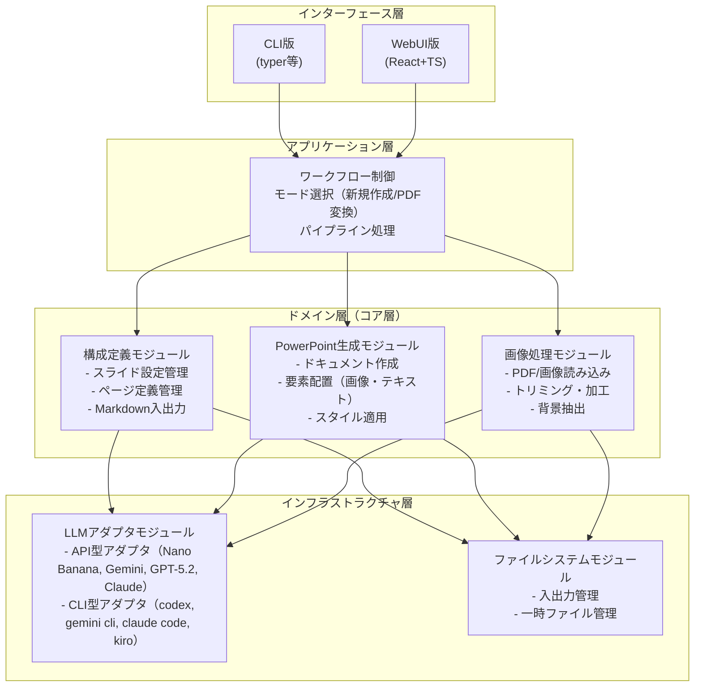
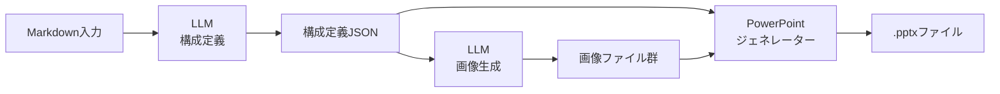
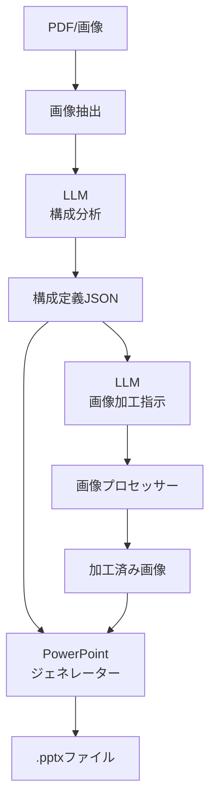

# slidemakerプロジェクト開発計画 - アーキテクチャ設計

## システムアーキテクチャ

### レイヤー構成



## 主要コンポーネント

### 1. ワークフローエンジン
- **責務**: 処理フローの制御と各モジュールの協調
- **主要クラス**:
  - `WorkflowOrchestrator`: 全体フロー制御
  - `NewSlideWorkflow`: 新規作成モードフロー
  - `ConversionWorkflow`: PDF/画像変換モードフロー

### 2. LLMマネージャー
- **責務**: LLM呼び出しの抽象化と統一インターフェース
- **主要クラス**:
  - `LLMManager`: LLM管理とルーティング
  - `LLMAdapter`: 抽象基底クラス
  - `APIAdapter`: API型LLMアダプタ
  - `CLIAdapter`: CLI型LLMアダプタ
- **設計パターン**: Strategy Pattern

### 3. 構成定義マネージャー
- **責務**: スライド設定とページ定義の管理
- **主要クラス**:
  - `SlideConfiguration`: スライド設定
  - `PageDefinition`: ページ定義
  - `ElementDefinition`: 要素定義（画像・テキスト）
  - `MarkdownSerializer`: Markdown入出力

### 4. PowerPointジェネレーター
- **責務**: PowerPointドキュメントの生成
- **主要クラス**:
  - `PowerPointGenerator`: メインジェネレーター
  - `SlideBuilder`: スライドページ構築
  - `ElementRenderer`: 要素レンダリング（画像・テキスト）
- **利用ライブラリ**: python-pptx

### 5. 画像プロセッサー
- **責務**: 画像の読み込み、加工、抽出
- **主要クラス**:
  - `ImageLoader`: PDF/画像読み込み
  - `ImageExtractor`: 要素抽出
  - `ImageProcessor`: トリミング・加工
- **利用ライブラリ**: Pillow, pdf2image

## データフロー

### 新規作成モード



### PDF/画像変換モード



## インターフェース設計

### CLI版インターフェース
```bash
# 新規作成
slidemaker create --input slide_plan.md --output presentation.pptx \
  --llm-config claude-opus --llm-image dalle-3

# PDF変換
slidemaker convert --input source.pdf --output presentation.pptx \
  --llm-config gemini-pro --llm-image stable-diffusion

# 設定ファイル使用
slidemaker create --input slide_plan.md --config config.yaml
```

### WebUI版インターフェース
- **フロントエンド**: React + TypeScript (SPA)
- **バックエンド**: AWS Lambda (Python 3.13)
- **API**: REST API via API Gateway
- **認証**: 将来的にCognito統合検討

### REST API設計
```
POST /api/v1/slides/create
  - Request: { markdown, llm_config, options }
  - Response: { job_id, status }

POST /api/v1/slides/convert
  - Request: { file_upload, llm_config, options }
  - Response: { job_id, status }

GET /api/v1/jobs/{job_id}
  - Response: { status, progress, result_url }

GET /api/v1/slides/{slide_id}/download
  - Response: .pptx file
```

## 非機能要件

### パフォーマンス
- LLM呼び出しの並列化（可能な場合）
- 画像処理の効率化
- 大量スライド対応（バッチ処理）

### スケーラビリティ
- WebUI版: Lambda並列実行による自動スケール
- 長時間処理: 非同期ジョブキュー（SQS検討）

### セキュリティ
- API認証・認可
- ファイルアップロードのバリデーション
- LLM API キーの安全な管理（環境変数、AWS Secrets Manager）

### 可観測性
- ログ: structlog使用
- メトリクス: CloudWatch連携（WebUI版）
- トレーシング: 処理時間計測

## 拡張性

### プラグイン機構
- カスタムLLMアダプタの追加
- カスタムテンプレートの追加
- カスタムエクスポート形式（PDF、画像等）

### 将来的な拡張
- Google Slides対応
- Keynote対応
- テンプレートライブラリ
- スライドプレビュー機能
