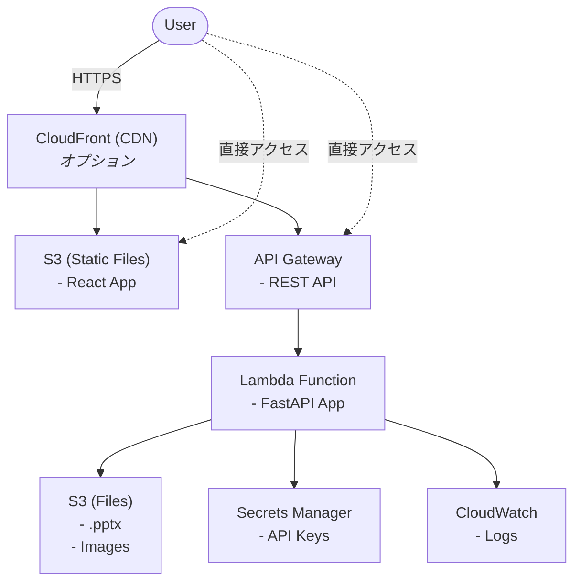

# slidemakerプロジェクト開発計画 - デプロイ戦略

## デプロイ概要

slidemakerは2つの形態でデプロイされます：
1. **CLI版**: PyPIパッケージとして配布
2. **WebUI版**: AWS Lambda + API Gatewayでホスティング

---

## CLI版デプロイ

### 配布方法
PyPIへの登録により、`pip install slidemaker`で簡単にインストール可能にします。

### パッケージ構成

#### pyproject.toml（uv用）
```toml
[project]
name = "slidemaker"
version = "1.0.0"
description = "AI-powered PowerPoint slide generator"
authors = [
    {name = "Your Name", email = "email@example.com"}
]
readme = "README.md"
license = {text = "MIT"}
requires-python = ">=3.13"
keywords = ["powerpoint", "slides", "ai", "llm", "automation"]
classifiers = [
    "Development Status :: 4 - Beta",
    "Intended Audience :: Developers",
    "License :: OSI Approved :: MIT License",
    "Programming Language :: Python :: 3.13",
    "Topic :: Office/Business",
]

dependencies = [
    "python-pptx>=0.6.21",
    "Pillow>=10.0.0",
    "pdf2image>=1.16.0",
    "pydantic>=2.0.0",
    "structlog>=23.1.0",
    "typer>=0.9.0",
    "rich>=13.0.0",
    "httpx>=0.25.0",
    "openai>=1.0.0",
    "anthropic>=0.8.0",
    "google-generativeai>=0.3.0",
    "PyYAML>=6.0",
]

[project.optional-dependencies]
dev = [
    "pytest>=7.4.0",
    "pytest-asyncio>=0.21.0",
    "pytest-cov>=4.1.0",
    "pytest-mock>=3.11.0",
    "mypy>=1.5.0",
    "ruff>=0.1.0",
]

[project.scripts]
slidemaker = "slidemaker.cli.main:app"

[project.urls]
Homepage = "https://github.com/yourusername/slidemaker"
Repository = "https://github.com/yourusername/slidemaker"
Documentation = "https://slidemaker.readthedocs.io"

[build-system]
requires = ["hatchling"]
build-backend = "hatchling.build"
```

### GitHub Actions CI/CD

#### .github/workflows/ci.yml
```yaml
name: CI

on:
  push:
    branches: [main, develop]
  pull_request:
    branches: [main, develop]

jobs:
  test:
    runs-on: ubuntu-latest
    strategy:
      matrix:
        python-version: ["3.13"]

    steps:
      - uses: actions/checkout@v4

      - name: Set up Python
        uses: actions/setup-python@v5
        with:
          python-version: ${{ matrix.python-version }}

      - name: Install uv
        run: |
          curl -LsSf https://astral.sh/uv/install.sh | sh
          echo "$HOME/.cargo/bin" >> $GITHUB_PATH

      - name: Create virtual environment
        run: |
          uv venv

      - name: Install dependencies
        run: |
          uv pip install -e ".[dev]"

      - name: Run linter
        run: |
          uv run ruff check src/

      - name: Run type checker
        run: |
          uv run mypy src/

      - name: Run tests
        run: |
          uv run pytest --cov=slidemaker --cov-report=xml

      - name: Upload coverage
        uses: codecov/codecov-action@v3
        with:
          file: ./coverage.xml
```

#### .github/workflows/publish.yml
```yaml
name: Publish to PyPI

on:
  push:
    tags:
      - "v*.*.*"

jobs:
  publish:
    runs-on: ubuntu-latest

    steps:
      - uses: actions/checkout@v4

      - name: Set up Python
        uses: actions/setup-python@v5
        with:
          python-version: "3.13"

      - name: Install uv
        run: |
          curl -LsSf https://astral.sh/uv/install.sh | sh
          echo "$HOME/.cargo/bin" >> $GITHUB_PATH

      - name: Install build tools
        run: |
          uv pip install --system build twine

      - name: Build package
        run: |
          python -m build

      - name: Publish to PyPI
        env:
          TWINE_USERNAME: __token__
          TWINE_PASSWORD: ${{ secrets.PYPI_API_TOKEN }}
        run: |
          twine upload dist/*
```

### リリースプロセス

1. **バージョン更新**
   ```bash
   # pyproject.tomlのversionフィールドを手動で更新
   vim pyproject.toml
   git add pyproject.toml
   git commit -m "Bump version to x.y.z"
   ```

2. **タグ作成**
   ```bash
   git tag vx.y.z
   git push origin vx.y.z
   ```

3. **自動公開**
   - GitHub Actionsが自動的にPyPIへ公開

### インストール方法

```bash
# ユーザー向け
pip install slidemaker

# 開発者向け
git clone https://github.com/yourusername/slidemaker.git
cd slidemaker

# uvをインストール（未インストールの場合）
curl -LsSf https://astral.sh/uv/install.sh | sh

# 仮想環境作成と依存関係インストール
uv venv
source .venv/bin/activate  # Windowsの場合: .venv\Scripts\activate
uv pip install -e ".[dev]"
```

---

## WebUI版デプロイ

### アーキテクチャ



### AWS CDK実装

#### infrastructure/app.py
```python
#!/usr/bin/env python3
import aws_cdk as cdk
from stacks.storage_stack import StorageStack
from stacks.lambda_stack import LambdaStack
from stacks.api_gateway_stack import ApiGatewayStack

app = cdk.App()

# 環境設定
env = cdk.Environment(
    account="YOUR_ACCOUNT_ID",
    region="us-east-1"
)

# スタック作成
storage_stack = StorageStack(app, "SlidemakerStorageStack", env=env)
lambda_stack = LambdaStack(
    app, "SlidemakerLambdaStack",
    storage_bucket=storage_stack.storage_bucket,
    env=env
)
api_stack = ApiGatewayStack(
    app, "SlidemakerApiGatewayStack",
    lambda_function=lambda_stack.handler,
    env=env
)

app.synth()
```

#### infrastructure/stacks/storage_stack.py
```python
from aws_cdk import (
    Stack,
    aws_s3 as s3,
    aws_dynamodb as dynamodb,
    RemovalPolicy,
    Duration,
)
from constructs import Construct

class StorageStack(Stack):
    def __init__(self, scope: Construct, id: str, **kwargs):
        super().__init__(scope, id, **kwargs)

        # S3バケット（生成ファイル保存用）
        self.storage_bucket = s3.Bucket(
            self, "StorageBucket",
            bucket_name="slidemaker-storage",
            cors=[s3.CorsRule(
                allowed_methods=[s3.HttpMethods.GET, s3.HttpMethods.PUT],
                allowed_origins=["*"],
                allowed_headers=["*"]
            )],
            lifecycle_rules=[
                s3.LifecycleRule(
                    id="DeleteOldFiles",
                    expiration=Duration.days(7),  # 7日後に自動削除
                    enabled=True
                )
            ],
            removal_policy=RemovalPolicy.DESTROY
        )

        # フロントエンド用S3バケット
        self.webui_bucket = s3.Bucket(
            self, "WebUIBucket",
            bucket_name="slidemaker-webui",
            website_index_document="index.html",
            public_read_access=True,
            removal_policy=RemovalPolicy.DESTROY
        )

        # DynamoDB（ジョブ管理用・オプション）
        self.jobs_table = dynamodb.Table(
            self, "JobsTable",
            table_name="slidemaker-jobs",
            partition_key=dynamodb.Attribute(
                name="job_id",
                type=dynamodb.AttributeType.STRING
            ),
            billing_mode=dynamodb.BillingMode.PAY_PER_REQUEST,
            removal_policy=RemovalPolicy.DESTROY
        )
```

#### infrastructure/stacks/lambda_stack.py
```python
from aws_cdk import (
    Stack,
    aws_lambda as lambda_,
    aws_iam as iam,
    aws_secretsmanager as secretsmanager,
    Duration,
)
from constructs import Construct

class LambdaStack(Stack):
    def __init__(self, scope: Construct, id: str, storage_bucket, **kwargs):
        super().__init__(scope, id, **kwargs)

        # Secrets Manager から API キーを取得
        llm_secrets = secretsmanager.Secret.from_secret_name_v2(
            self, "LLMSecrets",
            secret_name="slidemaker/llm-api-keys"
        )

        # Lambda Layer（依存関係）
        layer = lambda_.LayerVersion(
            self, "DependenciesLayer",
            code=lambda_.Code.from_asset("layer.zip"),
            compatible_runtimes=[lambda_.Runtime.PYTHON_3_13],
            description="slidemaker dependencies"
        )

        # Lambda関数
        self.handler = lambda_.Function(
            self, "Handler",
            function_name="slidemaker-api",
            runtime=lambda_.Runtime.PYTHON_3_13,
            code=lambda_.Code.from_asset("../src"),
            handler="slidemaker.api.app.handler",
            memory_size=3008,  # 最大メモリ
            timeout=Duration.minutes(15),  # 最大タイムアウト
            layers=[layer],
            environment={
                "STORAGE_BUCKET": storage_bucket.bucket_name,
                "LLM_SECRETS_ARN": llm_secrets.secret_arn,
            }
        )

        # S3バケットへの書き込み権限
        storage_bucket.grant_read_write(self.handler)

        # Secrets Manager 読み取り権限
        llm_secrets.grant_read(self.handler)
```

#### infrastructure/stacks/api_gateway_stack.py
```python
from aws_cdk import (
    Stack,
    aws_apigatewayv2 as apigw,
    aws_apigatewayv2_integrations as integrations,
)
from constructs import Construct

class ApiGatewayStack(Stack):
    def __init__(self, scope: Construct, id: str, lambda_function, **kwargs):
        super().__init__(scope, id, **kwargs)

        # HTTP API
        http_api = apigw.HttpApi(
            self, "HttpApi",
            api_name="slidemaker-api",
            cors_preflight=apigw.CorsPreflightOptions(
                allow_origins=["*"],
                allow_methods=[apigw.CorsHttpMethod.ANY],
                allow_headers=["*"]
            )
        )

        # Lambda統合
        integration = integrations.HttpLambdaIntegration(
            "LambdaIntegration",
            lambda_function
        )

        # ルート追加
        http_api.add_routes(
            path="/{proxy+}",
            methods=[apigw.HttpMethod.ANY],
            integration=integration
        )
```

### Lambda Layer作成

```bash
# 依存関係をlayerディレクトリにインストール
mkdir -p layer/python
pip install -r requirements.txt -t layer/python/

# ZIP作成
cd layer
zip -r ../layer.zip .
cd ..
```

### Secrets Manager設定

```bash
# APIキーをSecrets Managerに登録
aws secretsmanager create-secret \
  --name slidemaker/llm-api-keys \
  --secret-string '{
    "OPENAI_API_KEY": "sk-...",
    "ANTHROPIC_API_KEY": "sk-ant-...",
    "GOOGLE_API_KEY": "..."
  }'
```

### フロントエンドビルドとデプロイ

#### .github/workflows/deploy-webui.yml
```yaml
name: Deploy WebUI

on:
  push:
    branches: [main]
    paths:
      - "webui/**"

jobs:
  deploy:
    runs-on: ubuntu-latest

    steps:
      - uses: actions/checkout@v4

      - name: Set up Node.js
        uses: actions/setup-node@v4
        with:
          node-version: "24"

      - name: Install dependencies
        working-directory: webui
        run: npm ci

      - name: Build
        working-directory: webui
        env:
          VITE_API_URL: ${{ secrets.API_URL }}
        run: npm run build

      - name: Deploy to S3
        uses: jakejarvis/s3-sync-action@master
        with:
          args: --delete
        env:
          AWS_S3_BUCKET: slidemaker-webui
          AWS_ACCESS_KEY_ID: ${{ secrets.AWS_ACCESS_KEY_ID }}
          AWS_SECRET_ACCESS_KEY: ${{ secrets.AWS_SECRET_ACCESS_KEY }}
          AWS_REGION: us-east-1
          SOURCE_DIR: webui/dist

      - name: Invalidate CloudFront
        if: success()
        run: |
          aws cloudfront create-invalidation \
            --distribution-id ${{ secrets.CLOUDFRONT_DISTRIBUTION_ID }} \
            --paths "/*"
```

### CDKデプロイパイプライン

#### .github/workflows/deploy-cdk.yml
```yaml
name: Deploy CDK

on:
  push:
    branches: [main]
    paths:
      - "infrastructure/**"
      - "src/**"

jobs:
  deploy-staging:
    runs-on: ubuntu-latest
    environment: staging

    steps:
      - uses: actions/checkout@v4

      - name: Set up Python
        uses: actions/setup-python@v5
        with:
          python-version: "3.13"

      - name: Install CDK
        run: |
          npm install -g aws-cdk

      - name: Install dependencies
        working-directory: infrastructure
        run: pip install -r requirements.txt

      - name: CDK Synth
        working-directory: infrastructure
        run: cdk synth

      - name: CDK Deploy (Staging)
        working-directory: infrastructure
        env:
          AWS_ACCESS_KEY_ID: ${{ secrets.AWS_ACCESS_KEY_ID }}
          AWS_SECRET_ACCESS_KEY: ${{ secrets.AWS_SECRET_ACCESS_KEY }}
        run: cdk deploy --all --require-approval never

  deploy-production:
    needs: deploy-staging
    runs-on: ubuntu-latest
    environment: production

    steps:
      # 本番環境への承認後デプロイ
      - uses: actions/checkout@v4
      # ... (staging と同様の手順)
```

---

## 環境別設定

### 開発環境
- **API**: localhost:8000（uvicorn）
- **WebUI**: localhost:5173（Vite dev server）
- **LLM**: モック使用

### ステージング環境
- **API**: https://staging-api.slidemaker.example.com
- **WebUI**: https://staging.slidemaker.example.com
- **LLM**: 実際のAPI（低コストモデル）

### 本番環境
- **API**: https://api.slidemaker.example.com
- **WebUI**: https://slidemaker.example.com
- **LLM**: 実際のAPI（高性能モデル）

---

## モニタリングとログ

### CloudWatch設定

```python
# Lambda関数に自動的にCloudWatchログが作成される
# ログ保持期間を設定
logs.LogGroup(
    self, "LambdaLogGroup",
    log_group_name=f"/aws/lambda/{handler.function_name}",
    retention=logs.RetentionDays.ONE_WEEK
)

# アラーム設定
cloudwatch.Alarm(
    self, "ErrorAlarm",
    metric=handler.metric_errors(),
    threshold=10,
    evaluation_periods=1,
    alarm_description="Lambda errors exceed threshold"
)
```

### メトリクスダッシュボード

```python
dashboard = cloudwatch.Dashboard(
    self, "Dashboard",
    dashboard_name="slidemaker-metrics"
)

dashboard.add_widgets(
    cloudwatch.GraphWidget(
        title="Lambda Invocations",
        left=[handler.metric_invocations()]
    ),
    cloudwatch.GraphWidget(
        title="API Gateway Requests",
        left=[http_api.metric_count()]
    )
)
```

---

## コスト見積もり

### CLI版
- PyPI: 無料
- GitHub Actions: 無料（公開リポジトリ）

### WebUI版（月間1000リクエスト想定）

| サービス | 使用量 | コスト |
|---------|--------|--------|
| Lambda | 1000実行 x 3GB x 30秒 | $0.50 |
| API Gateway | 1000リクエスト | $0.01 |
| S3（保存） | 10GB | $0.23 |
| S3（転送） | 100GB | $9.00 |
| CloudWatch | ログ保存 | $0.50 |
| **合計** | | **約$10/月** |

---

## セキュリティ

### APIキー管理
- Secrets Managerで暗号化
- IAMロールベースのアクセス制御
- 定期的なローテーション

### ネットワーク
- HTTPS必須
- CORS適切に設定
- APIレート制限

### データ保護
- S3暗号化（SSE-S3）
- 自動削除ポリシー（個人情報保護）
- アクセスログ

---

## バックアップとディザスタリカバリ

### バックアップ戦略
- コードリポジトリ: Git（GitHub）
- インフラ設定: CDKコード（Git管理）
- データ: S3自動レプリケーション（オプション）

### リカバリ手順
1. CDKコードからスタック再作成
2. Secrets Managerから設定復元
3. 動作確認

---

## スケーリング戦略

### Lambda自動スケーリング
- 同時実行数制限: 100（初期）
- Provisioned Concurrency: オプション（レイテンシ改善）

### S3スケーリング
- 自動的に無制限スケール
- Transfer Acceleration（グローバル利用時）

### コスト最適化
- Lambda メモリ最適化
- CloudWatch ログ保持期間調整
- S3 Intelligent-Tiering（大量データ時）

---

## ロールバック手順

### CLI版
```bash
# PyPIで以前のバージョンを指定
pip install slidemaker==x.y.z
```

### WebUI版
```bash
# CDKで以前のバージョンをデプロイ
git checkout v1.0.0
cd infrastructure
cdk deploy --all
```

---

## メンテナンス

### 定期タスク
- 依存関係更新（月次）
- セキュリティパッチ適用（随時）
- ログレビュー（週次）
- コスト分析（月次）

### 更新手順
1. 開発環境でテスト
2. ステージング環境にデプロイ
3. 動作確認
4. 本番環境にデプロイ
5. モニタリング
