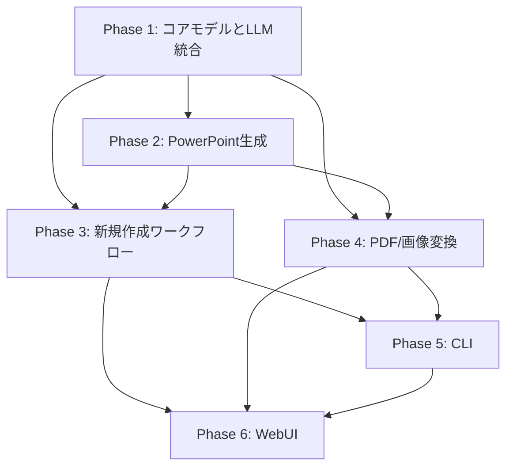

# Phase 2-6 実装ロードマップ

## 概要

本ドキュメントは、Phase 1完了後の残り開発フェーズの詳細実装計画を示します。各フェーズの実装範囲、ファイル構成、依存関係、テスト要件を明確化します。

## Phase 2: PowerPoint生成機能

**目的**: python-pptxを使用してスライドを実際のPowerPointファイルに変換する機能を実装

**推定規模**: 中規模（約800-1000行）

### 実装ファイル

#### 2.1 生成器基底クラス (src/slidemaker/pptx/generator.py)

```python
class PowerPointGenerator:
    """PowerPoint生成のメインクラス"""

    def __init__(self, config: SlideConfig):
        """Presentationオブジェクトの初期化"""

    async def generate(
        self,
        pages: list[PageDefinition],
        output_path: str | Path
    ) -> Path:
        """スライドデッキの生成"""

    def _apply_slide_config(self) -> None:
        """スライドサイズと設定の適用"""
```

**実装内容**:
- `python-pptx.Presentation`のラッパー
- スライドサイズ設定（4:3, 16:9, 16:10）
- テーマとマスタースライド設定
- ページ定義のループ処理
- ファイル保存処理

**依存関係**: Phase 1のデータモデル

#### 2.2 スライドビルダー (src/slidemaker/pptx/slide_builder.py)

```python
class SlideBuilder:
    """個別スライドの構築"""

    def build_slide(
        self,
        presentation: Presentation,
        page: PageDefinition
    ) -> Slide:
        """ページ定義から1枚のスライドを構築"""

    def _add_background(self, slide: Slide, background: BackgroundConfig) -> None:
        """背景の追加（色または画像）"""

    def _add_elements(self, slide: Slide, elements: list[ElementDefinition]) -> None:
        """要素の追加（テキストと画像）"""
```

**実装内容**:
- 空白スライドの作成
- 背景色/背景画像の設定
- 要素の配置とレンダリング
- レイアウト調整

**依存関係**: PowerPointGenerator

#### 2.3 テキストレンダラー (src/slidemaker/pptx/renderers/text_renderer.py)

```python
class TextRenderer:
    """テキスト要素のレンダリング"""

    def render(self, slide: Slide, element: TextElement) -> None:
        """テキストボックスの作成と設定"""

    def _apply_font_config(self, text_frame: TextFrame, config: FontConfig) -> None:
        """フォント設定の適用"""

    def _apply_alignment(self, paragraph: Paragraph, alignment: Alignment) -> None:
        """テキスト配置の適用"""
```

**実装内容**:
- テキストボックスの位置・サイズ設定
- フォント（名前、サイズ、色、太字、斜体）の適用
- 配置（左/中央/右）の設定
- 改行とフォーマットの処理

**依存関係**: SlideBuilder, Phase 1のTextElement

#### 2.4 画像レンダラー (src/slidemaker/pptx/renderers/image_renderer.py)

```python
class ImageRenderer:
    """画像要素のレンダリング"""

    def render(self, slide: Slide, element: ImageElement) -> None:
        """画像の追加"""

    def _apply_fit_mode(
        self,
        image_path: Path,
        position: Position,
        size: Size,
        fit_mode: FitMode
    ) -> tuple[Position, Size]:
        """フィット方式に応じた位置・サイズ調整"""
```

**実装内容**:
- 画像ファイルの読み込み
- 位置・サイズの設定
- フィット方式（contain/cover/fill）の適用
- アスペクト比の維持
- 画像形式のサポート（PNG, JPEG, GIF）

**依存関係**: SlideBuilder, Phase 1のImageElement

#### 2.5 スタイル適用器 (src/slidemaker/pptx/style_applier.py)

```python
class StyleApplier:
    """スライド全体のスタイル適用"""

    def apply_theme(self, presentation: Presentation, theme: dict[str, Any]) -> None:
        """テーマの適用"""

    def apply_master_slide(self, presentation: Presentation, master: dict[str, Any]) -> None:
        """マスタースライドの適用"""
```

**実装内容**:
- デフォルトフォントの設定
- カラースキームの適用
- マスタースライドのカスタマイズ
- テンプレートのサポート

**依存関係**: PowerPointGenerator

### テスト実装

#### tests/pptx/test_generator.py
- PowerPoint生成の基本テスト
- サイズ設定のテスト
- ファイル出力のテスト

#### tests/pptx/test_slide_builder.py
- スライド構築のテスト
- 背景設定のテスト
- 要素配置のテスト

#### tests/pptx/test_renderers.py
- テキストレンダリングのテスト
- 画像レンダリングのテスト
- フィット方式のテスト

#### tests/pptx/integration/test_full_generation.py
- エンドツーエンドの生成テスト
- 複雑なスライドデッキのテスト

### マイルストーン

- [ ] PowerPointGeneratorの基本実装
- [ ] SlideBuilderの実装
- [ ] TextRendererの実装
- [ ] ImageRendererの実装
- [ ] StyleApplierの実装
- [ ] ユニットテスト（カバレッジ80%以上）
- [ ] 統合テスト
- [ ] サンプルPowerPoint生成の動作確認

---

## Phase 3: 新規作成ワークフロー

**目的**: Markdownから最終PowerPointまでの完全なパイプラインを実装

**推定規模**: 中規模（約700-900行）

### 実装ファイル

#### 3.1 ワークフローオーケストレータ (src/slidemaker/workflows/base.py)

```python
class WorkflowOrchestrator(ABC):
    """ワークフロー実行の基底クラス"""

    def __init__(self, llm_manager: LLMManager, file_manager: FileManager):
        """依存コンポーネントの注入"""

    @abstractmethod
    async def execute(self, input_data: Any, config: AppConfig) -> Path:
        """ワークフローの実行"""

    async def _run_step(self, step_name: str, step_func: Callable) -> Any:
        """ステップの実行とエラーハンドリング"""
```

**実装内容**:
- 抽象ワークフロー定義
- ステップ管理とエラーハンドリング
- 進捗ログ出力
- リトライロジック

**依存関係**: Phase 1のLLMManager, FileManager

#### 3.2 新規作成ワークフロー (src/slidemaker/workflows/new_slide.py)

```python
class NewSlideWorkflow(WorkflowOrchestrator):
    """Markdownから新規スライド作成"""

    async def execute(self, markdown_path: str | Path, config: AppConfig) -> Path:
        """実行メインメソッド"""

    async def _parse_markdown(self, path: Path) -> dict[str, Any]:
        """Markdownのパース"""

    async def _generate_composition(self, parsed_data: dict) -> dict[str, Any]:
        """LLMによる構成生成"""

    async def _generate_images(self, composition: dict) -> dict[str, Path]:
        """画像生成（必要に応じて）"""

    async def _create_slide_definitions(
        self,
        composition: dict,
        images: dict[str, Path]
    ) -> tuple[SlideConfig, list[PageDefinition]]:
        """スライド定義の作成"""

    async def _generate_powerpoint(
        self,
        config: SlideConfig,
        pages: list[PageDefinition],
        output_path: Path
    ) -> Path:
        """PowerPointファイルの生成"""
```

**実装内容**:
- Markdownパース（Phase 1のMarkdownSerializer使用）
- LLMによる構成生成（テキスト配置、画像配置の決定）
- 画像生成プロンプトの作成
- 画像生成の実行（オプション）
- スライド定義への変換
- PowerPoint生成（Phase 2のPowerPointGenerator使用）

**依存関係**: Phase 1 (LLM, Serializer), Phase 2 (Generator)

#### 3.3 構成パーサー (src/slidemaker/workflows/composition_parser.py)

```python
class CompositionParser:
    """LLM生成の構成データをパース"""

    def parse_composition(self, composition_json: dict) -> list[PageDefinition]:
        """構成JSONからページ定義へ変換"""

    def _validate_composition(self, composition: dict) -> None:
        """構成データのバリデーション"""

    def _extract_elements(self, slide_data: dict) -> list[ElementDefinition]:
        """要素の抽出"""
```

**実装内容**:
- LLM出力JSONのバリデーション
- PageDefinitionへの変換
- 座標・サイズの正規化
- エラーハンドリング

**依存関係**: Phase 1のデータモデル

#### 3.4 画像生成コーディネーター (src/slidemaker/workflows/image_coordinator.py)

```python
class ImageCoordinator:
    """画像生成の調整"""

    def __init__(self, llm_manager: LLMManager):
        """LLMマネージャーの注入"""

    async def generate_images(
        self,
        image_requests: list[dict]
    ) -> dict[str, Path]:
        """複数画像の生成"""

    async def _generate_single_image(self, request: dict) -> Path:
        """単一画像の生成"""
```

**実装内容**:
- 画像生成リクエストの管理
- 並行生成の調整
- 画像生成プロンプトの最適化
- 生成結果のキャッシュ

**依存関係**: Phase 1のLLMManager

### テスト実装

#### tests/workflows/test_new_slide.py
- 新規作成ワークフローのテスト
- Markdown → PowerPointのエンドツーエンドテスト
- モックLLMを使用したユニットテスト

#### tests/workflows/test_composition_parser.py
- 構成パーサーのテスト
- バリデーションのテスト

#### tests/workflows/test_image_coordinator.py
- 画像生成調整のテスト
- 並行処理のテスト

#### tests/workflows/integration/test_full_workflow.py
- 完全なワークフローの統合テスト
- 実際のLLMを使用したE2Eテスト（オプション）

### マイルストーン

- [ ] WorkflowOrchestratorの基底クラス実装
- [ ] NewSlideWorkflowの実装
- [ ] CompositionParserの実装
- [ ] ImageCoordinatorの実装
- [ ] ユニットテスト（カバレッジ80%以上）
- [ ] 統合テスト
- [ ] サンプルMarkdownからのスライド生成確認

---

## Phase 4: PDF/画像変換ワークフロー

**目的**: PDF/画像ファイルからスライドを抽出・解析し、PowerPointに変換

**推定規模**: 中〜大規模（約900-1200行）

### 実装ファイル

#### 4.1 画像ローダー (src/slidemaker/image_processing/loader.py)

```python
class ImageLoader:
    """PDFと画像ファイルの読み込み"""

    async def load_pdf(self, pdf_path: Path) -> list[Image.Image]:
        """PDFをページ画像に変換（pdf2imageを使用）"""

    async def load_images(self, image_paths: list[Path]) -> list[Image.Image]:
        """複数画像ファイルの読み込み"""

    def _normalize_image(self, image: Image.Image, target_size: tuple[int, int]) -> Image.Image:
        """画像の正規化（サイズ、形式）"""
```

**実装内容**:
- PDF → 画像変換（pdf2image）
- 各種画像形式の読み込み（PNG, JPEG, GIF, BMP）
- 画像の正規化とリサイズ
- DPI設定の最適化

**依存関係**: Pillow, pdf2image

#### 4.2 画像アナライザー (src/slidemaker/image_processing/analyzer.py)

```python
class ImageAnalyzer:
    """LLMを使った画像分析"""

    def __init__(self, llm_manager: LLMManager):
        """LLMマネージャーの注入"""

    async def analyze_slide(self, image: Image.Image) -> dict[str, Any]:
        """スライド画像の分析"""

    async def _detect_elements(self, image: Image.Image) -> list[dict]:
        """要素の検出（テキスト、画像領域）"""

    async def _extract_text_content(self, image: Image.Image, bbox: tuple) -> str:
        """テキスト内容の抽出（OCRまたはLLM）"""
```

**実装内容**:
- LLMによる画像分析（Phase 1のプロンプト使用）
- 要素の検出と分類（テキスト/画像）
- 座標とサイズの抽出
- テキスト内容の抽出
- スタイル情報の推定（フォント、色）

**依存関係**: Phase 1のLLMManager, image_processing prompts

#### 4.3 画像プロセッサー (src/slidemaker/image_processing/processor.py)

```python
class ImageProcessor:
    """画像要素の抽出と加工"""

    async def extract_image_element(
        self,
        source_image: Image.Image,
        bbox: tuple[int, int, int, int]
    ) -> Image.Image:
        """画像要素の抽出"""

    async def remove_background(self, image: Image.Image) -> Image.Image:
        """背景除去（オプション）"""

    async def clean_image(self, image: Image.Image) -> Image.Image:
        """画像のクリーニング"""
```

**実装内容**:
- 指定領域の切り出し
- 背景除去（rembgなど）
- ノイズ除去
- アスペクト比の維持
- 画像品質の最適化

**依存関係**: Pillow, rembg (オプション)

#### 4.4 変換ワークフロー (src/slidemaker/workflows/conversion.py)

```python
class ConversionWorkflow(WorkflowOrchestrator):
    """PDF/画像からPowerPointへの変換"""

    async def execute(self, input_paths: list[Path], config: AppConfig) -> Path:
        """実行メインメソッド"""

    async def _load_images(self, paths: list[Path]) -> list[Image.Image]:
        """画像の読み込み"""

    async def _analyze_images(self, images: list[Image.Image]) -> list[dict]:
        """画像の分析"""

    async def _process_images(self, images: list[Image.Image], analyses: list[dict]) -> dict[str, Path]:
        """画像要素の抽出と保存"""

    async def _create_slide_definitions(
        self,
        analyses: list[dict],
        processed_images: dict[str, Path]
    ) -> tuple[SlideConfig, list[PageDefinition]]:
        """スライド定義の作成"""

    async def _generate_powerpoint(
        self,
        config: SlideConfig,
        pages: list[PageDefinition],
        output_path: Path
    ) -> Path:
        """PowerPointファイルの生成"""
```

**実装内容**:
- 画像読み込み（PDF含む）
- 各ページの分析
- 画像要素の抽出と加工
- スライド定義への変換
- PowerPoint生成

**依存関係**: Phase 1, Phase 2, ImageLoader, ImageAnalyzer, ImageProcessor

### テスト実装

#### tests/image_processing/test_loader.py
- PDF読み込みのテスト
- 画像読み込みのテスト
- 正規化のテスト

#### tests/image_processing/test_analyzer.py
- 画像分析のテスト（モックLLM）
- 要素検出のテスト

#### tests/image_processing/test_processor.py
- 画像抽出のテスト
- 背景除去のテスト

#### tests/workflows/test_conversion.py
- 変換ワークフローのテスト
- PDF → PowerPointのエンドツーエンドテスト

#### tests/workflows/integration/test_conversion_workflow.py
- 完全な変換ワークフローの統合テスト

### マイルストーン

- [ ] ImageLoaderの実装
- [ ] ImageAnalyzerの実装
- [ ] ImageProcessorの実装
- [ ] ConversionWorkflowの実装
- [ ] ユニットテスト（カバレッジ80%以上）
- [ ] 統合テスト
- [ ] サンプルPDFからのスライド生成確認

---

## Phase 5: CLIインターフェース

**目的**: コマンドラインから操作できるCLIツールの実装

**推定規模**: 小〜中規模（約400-600行）

### 実装ファイル

#### 5.1 CLIメインエントリーポイント (src/slidemaker/cli/main.py)

```python
import typer

app = typer.Typer(
    name="slidemaker",
    help="AI-powered PowerPoint generator",
    add_completion=False
)

@app.callback()
def main(
    config_file: Optional[Path] = typer.Option(
        None,
        "--config",
        "-c",
        help="Configuration file path"
    ),
    verbose: bool = typer.Option(
        False,
        "--verbose",
        "-v",
        help="Enable verbose output"
    )
):
    """Slidemaker CLI"""
    # グローバル設定の初期化

if __name__ == "__main__":
    app()
```

**実装内容**:
- Typerを使用したCLIフレームワーク
- グローバルオプション（config, verbose, version）
- サブコマンドの登録
- エラーハンドリングとユーザーフレンドリーなメッセージ

**依存関係**: typer, rich

#### 5.2 createコマンド (src/slidemaker/cli/commands/create.py)

```python
@app.command()
async def create(
    input_file: Path = typer.Argument(
        ...,
        help="Markdown input file",
        exists=True
    ),
    output: Optional[Path] = typer.Option(
        None,
        "--output",
        "-o",
        help="Output PowerPoint file path"
    ),
    theme: Optional[str] = typer.Option(
        None,
        "--theme",
        help="Theme name"
    ),
    dry_run: bool = typer.Option(
        False,
        "--dry-run",
        help="Preview without generating"
    )
):
    """Create slides from Markdown"""
    # NewSlideWorkflowの実行
```

**実装内容**:
- Markdown入力の受付
- 出力パスの指定
- テーマ選択（オプション）
- ドライラン機能（JSON出力のみ）
- 進捗表示（richプログレスバー）

**依存関係**: Phase 3のNewSlideWorkflow

#### 5.3 convertコマンド (src/slidemaker/cli/commands/convert.py)

```python
@app.command()
async def convert(
    input_files: List[Path] = typer.Argument(
        ...,
        help="PDF or image files",
        exists=True
    ),
    output: Optional[Path] = typer.Option(
        None,
        "--output",
        "-o",
        help="Output PowerPoint file path"
    ),
    analyze_only: bool = typer.Option(
        False,
        "--analyze-only",
        help="Analyze without converting"
    )
):
    """Convert PDF/images to slides"""
    # ConversionWorkflowの実行
```

**実装内容**:
- PDF/画像ファイルの受付
- 複数ファイルのサポート
- 分析のみモード（JSON出力）
- 進捗表示

**依存関係**: Phase 4のConversionWorkflow

#### 5.4 設定管理 (src/slidemaker/cli/config.py)

```python
class CLIConfig:
    """CLI設定の管理"""

    def __init__(self):
        """デフォルト設定の読み込み"""

    def load(self, config_path: Path | None) -> AppConfig:
        """設定ファイルの読み込み"""

    def get_default_config_path(self) -> Path:
        """デフォルト設定パスの取得（~/.slidemaker/config.yaml）"""
```

**実装内容**:
- 設定ファイルの検索と読み込み
- 環境変数のオーバーライド
- デフォルト値の提供

**依存関係**: Phase 1のconfig_loader

#### 5.5 出力フォーマッター (src/slidemaker/cli/output.py)

```python
class OutputFormatter:
    """CLI出力のフォーマット"""

    def print_success(self, message: str, file_path: Path) -> None:
        """成功メッセージの出力"""

    def print_error(self, error: Exception) -> None:
        """エラーメッセージの出力"""

    def print_progress(self, current: int, total: int, message: str) -> None:
        """進捗の表示"""

    def print_json(self, data: dict) -> None:
        """JSON出力"""
```

**実装内容**:
- Rich libraryを使用した美しい出力
- 進捗バー、スピナー
- カラー出力
- JSON出力オプション

**依存関係**: rich

### pyproject.toml エントリーポイント設定

```toml
[project.scripts]
slidemaker = "slidemaker.cli.main:app"
```

### テスト実装

#### tests/cli/test_main.py
- CLIメインのテスト
- グローバルオプションのテスト

#### tests/cli/test_create.py
- createコマンドのテスト
- オプション処理のテスト

#### tests/cli/test_convert.py
- convertコマンドのテスト
- ファイル処理のテスト

#### tests/cli/test_config.py
- 設定管理のテスト
- 環境変数オーバーライドのテスト

#### tests/cli/integration/test_cli_e2e.py
- CLIのエンドツーエンドテスト
- 実際のコマンド実行テスト

### マイルストーン

- [ ] CLIメインエントリーポイントの実装
- [ ] createコマンドの実装
- [ ] convertコマンドの実装
- [ ] 設定管理の実装
- [ ] 出力フォーマッターの実装
- [ ] ユニットテスト（カバレッジ80%以上）
- [ ] E2Eテスト
- [ ] ドキュメント更新（使用方法）

---

## Phase 6: WebUIとデプロイメント

**目的**: Webインターフェースの実装とAWSへのデプロイ

**推定規模**: 大規模（約2000-3000行、Python + TypeScript）

### 6.1 バックエンドAPI (Python + FastAPI)

#### src/slidemaker/api/main.py

```python
from fastapi import FastAPI, UploadFile, File
from fastapi.middleware.cors import CORSMiddleware

app = FastAPI(
    title="Slidemaker API",
    version="0.1.0",
    description="AI-powered PowerPoint generator API"
)

app.add_middleware(
    CORSMiddleware,
    allow_origins=["*"],  # 本番では制限
    allow_credentials=True,
    allow_methods=["*"],
    allow_headers=["*"],
)

@app.post("/api/v1/slides/create")
async def create_slides(markdown: UploadFile = File(...)):
    """Markdownからスライド作成"""

@app.post("/api/v1/slides/convert")
async def convert_slides(files: List[UploadFile] = File(...)):
    """PDF/画像からスライド変換"""

@app.get("/api/v1/slides/{task_id}/status")
async def get_task_status(task_id: str):
    """タスクステータスの取得"""

@app.get("/api/v1/slides/{task_id}/download")
async def download_result(task_id: str):
    """生成されたスライドのダウンロード"""
```

**実装内容**:
- FastAPIアプリケーション
- ファイルアップロード処理
- 非同期タスク処理（Celery or AWS Lambda）
- ダウンロードエンドポイント
- エラーハンドリング
- API認証（JWT）

**依存関係**: FastAPI, Phase 3, Phase 4

#### src/slidemaker/api/models.py

```python
from pydantic import BaseModel

class CreateRequest(BaseModel):
    """スライド作成リクエスト"""
    theme: Optional[str] = None
    options: dict[str, Any] = {}

class TaskResponse(BaseModel):
    """タスクレスポンス"""
    task_id: str
    status: str
    progress: int
    result_url: Optional[str] = None
```

#### src/slidemaker/api/tasks.py

```python
class TaskManager:
    """非同期タスクの管理"""

    async def create_task(self, workflow_type: str, input_data: Any) -> str:
        """タスクの作成"""

    async def get_task_status(self, task_id: str) -> dict:
        """タスクステータスの取得"""
```

### 6.2 フロントエンド (React + TypeScript)

#### ディレクトリ構造

```
frontend/
├── public/
├── src/
│   ├── components/
│   │   ├── FileUpload.tsx
│   │   ├── ProgressBar.tsx
│   │   ├── ResultViewer.tsx
│   │   └── ThemeSelector.tsx
│   ├── pages/
│   │   ├── CreatePage.tsx
│   │   ├── ConvertPage.tsx
│   │   └── HomePage.tsx
│   ├── hooks/
│   │   ├── useFileUpload.ts
│   │   └── useTaskStatus.ts
│   ├── api/
│   │   └── client.ts
│   ├── types/
│   │   └── api.ts
│   ├── App.tsx
│   └── main.tsx
├── package.json
├── vite.config.ts
└── tsconfig.json
```

#### frontend/src/components/FileUpload.tsx

```typescript
import React, { useState, useCallback } from 'react';
import { useDropzone } from 'react-dropzone';

interface FileUploadProps {
  accept: string;
  onUpload: (files: File[]) => void;
}

export const FileUpload: React.FC<FileUploadProps> = ({ accept, onUpload }) => {
  const { getRootProps, getInputProps, isDragActive } = useDropzone({
    accept,
    onDrop: onUpload
  });

  return (
    <div {...getRootProps()} className="dropzone">
      <input {...getInputProps()} />
      {isDragActive ? (
        <p>Drop files here...</p>
      ) : (
        <p>Drag & drop files, or click to select</p>
      )}
    </div>
  );
};
```

#### frontend/src/api/client.ts

```typescript
import axios from 'axios';

const API_BASE = import.meta.env.VITE_API_BASE_URL || 'http://localhost:8000';

export const createSlides = async (markdown: File) => {
  const formData = new FormData();
  formData.append('markdown', markdown);

  const response = await axios.post(`${API_BASE}/api/v1/slides/create`, formData);
  return response.data;
};

export const getTaskStatus = async (taskId: string) => {
  const response = await axios.get(`${API_BASE}/api/v1/slides/${taskId}/status`);
  return response.data;
};
```

### 6.3 AWSデプロイメント (CDK)

#### infrastructure/cdk/lib/slidemaker-stack.ts

```typescript
import * as cdk from 'aws-cdk-lib';
import * as lambda from 'aws-cdk-lib/aws-lambda';
import * as apigateway from 'aws-cdk-lib/aws-apigateway';
import * as s3 from 'aws-cdk-lib/aws-s3';
import * as cloudfront from 'aws-cdk-lib/aws-cloudfront';

export class SlidemakerStack extends cdk.Stack {
  constructor(scope: cdk.App, id: string, props?: cdk.StackProps) {
    super(scope, id, props);

    // S3 bucket for file storage
    const storageBucket = new s3.Bucket(this, 'SlidemakerStorage', {
      versioned: true,
      encryption: s3.BucketEncryption.S3_MANAGED,
    });

    // Lambda function
    const apiFunction = new lambda.Function(this, 'SlidemakerAPI', {
      runtime: lambda.Runtime.PYTHON_3_13,
      handler: 'slidemaker.api.main.handler',
      code: lambda.Code.fromAsset('../../dist'),
      timeout: cdk.Duration.minutes(5),
      memorySize: 1024,
      environment: {
        STORAGE_BUCKET: storageBucket.bucketName,
      },
    });

    // API Gateway
    const api = new apigateway.LambdaRestApi(this, 'SlidemakerAPI', {
      handler: apiFunction,
      proxy: true,
    });

    // CloudFront for frontend
    const frontendBucket = new s3.Bucket(this, 'SlidemakerFrontend', {
      websiteIndexDocument: 'index.html',
    });

    const distribution = new cloudfront.CloudFrontWebDistribution(
      this,
      'SlidemakerDistribution',
      {
        originConfigs: [
          {
            s3OriginSource: {
              s3BucketSource: frontendBucket,
            },
            behaviors: [{ isDefaultBehavior: true }],
          },
        ],
      }
    );
  }
}
```

#### infrastructure/cdk/bin/cdk.ts

```typescript
import 'source-map-support/register';
import * as cdk from 'aws-cdk-lib';
import { SlidemakerStack } from '../lib/slidemaker-stack';

const app = new cdk.App();
new SlidemakerStack(app, 'SlidemakerStack', {
  env: {
    account: process.env.CDK_DEFAULT_ACCOUNT,
    region: process.env.CDK_DEFAULT_REGION || 'us-east-1',
  },
});
```

### 6.4 CI/CDパイプライン

#### .github/workflows/deploy-api.yml

```yaml
name: Deploy API

on:
  push:
    branches: [main]
    tags: ['v*']

jobs:
  deploy:
    runs-on: ubuntu-latest
    steps:
      - uses: actions/checkout@v4

      - name: Set up Python
        uses: actions/setup-python@v5
        with:
          python-version: '3.13'

      - name: Install uv
        run: curl -LsSf https://astral.sh/uv/install.sh | sh

      - name: Build package
        run: |
          uv sync
          uv build

      - name: Configure AWS credentials
        uses: aws-actions/configure-aws-credentials@v4
        with:
          aws-access-key-id: ${{ secrets.AWS_ACCESS_KEY_ID }}
          aws-secret-access-key: ${{ secrets.AWS_SECRET_ACCESS_KEY }}
          aws-region: us-east-1

      - name: Deploy to AWS Lambda
        run: |
          cd infrastructure/cdk
          npm install
          npm run cdk deploy -- --require-approval never
```

#### .github/workflows/deploy-frontend.yml

```yaml
name: Deploy Frontend

on:
  push:
    branches: [main]

jobs:
  deploy:
    runs-on: ubuntu-latest
    steps:
      - uses: actions/checkout@v4

      - name: Set up Node.js
        uses: actions/setup-node@v4
        with:
          node-version: '24'

      - name: Install dependencies
        run: |
          cd frontend
          npm install

      - name: Build
        run: |
          cd frontend
          npm run build

      - name: Configure AWS credentials
        uses: aws-actions/configure-aws-credentials@v4
        with:
          aws-access-key-id: ${{ secrets.AWS_ACCESS_KEY_ID }}
          aws-secret-access-key: ${{ secrets.AWS_SECRET_ACCESS_KEY }}
          aws-region: us-east-1

      - name: Deploy to S3
        run: |
          aws s3 sync frontend/dist s3://slidemaker-frontend-${{ secrets.BUCKET_SUFFIX }}/
          aws cloudfront create-invalidation --distribution-id ${{ secrets.CLOUDFRONT_ID }} --paths "/*"
```

### テスト実装

#### tests/api/test_endpoints.py
- APIエンドポイントのテスト
- ファイルアップロードのテスト
- エラーハンドリングのテスト

#### frontend/src/__tests__/
- Reactコンポーネントのテスト（Vitest + React Testing Library）
- APIクライアントのテスト

#### tests/integration/test_api_workflow.py
- API経由の完全ワークフローテスト

### マイルストーン

- [ ] FastAPI実装
- [ ] React frontend実装
- [ ] AWS CDKインフラ定義
- [ ] CI/CDパイプライン設定
- [ ] バックエンドユニットテスト
- [ ] フロントエンドテスト
- [ ] 統合テスト
- [ ] ステージング環境デプロイ
- [ ] 本番環境デプロイ
- [ ] ドキュメント更新

---

## フェーズ間の依存関係



### 並行実装可能な部分

- **Phase 2とPhase 3の一部**: PowerPoint生成とMarkdownパース部分は並行実装可能
- **Phase 5とPhase 6**: CLIとWebUIは独立して実装可能（Phase 3/4完了後）

---

## 品質基準

### コードカバレッジ
- ユニットテスト: 80%以上
- 統合テスト: 主要ワークフロー100%
- E2Eテスト: 主要ユースケース100%

### パフォーマンス
- スライド生成: 10スライド/分以上
- PDF変換: 1ページ/秒以上
- API応答: 95%ile < 5秒

### セキュリティ
- すべてのファイル操作でパストラバーサル対策
- API認証必須
- 環境変数でシークレット管理
- 入力バリデーション徹底

### ドキュメント
- 各モジュールにdocstring
- README更新
- API仕様書（OpenAPI）
- ユーザーガイド

---

## 推定工数

| フェーズ | 推定工数 | 実装規模 | 複雑度 |
|---------|---------|---------|--------|
| Phase 1完了 | 1-2週 | 小 | 中 |
| Phase 2 | 2-3週 | 中 | 中 |
| Phase 3 | 2-3週 | 中 | 高 |
| Phase 4 | 3-4週 | 大 | 高 |
| Phase 5 | 1-2週 | 小 | 低 |
| Phase 6 | 4-6週 | 大 | 高 |
| **合計** | **13-20週** | | |

注: 工数はフルタイム1人での推定値です。

---

## 次のアクション

1. **Phase 1の完了**:
   - GPT/Geminiアダプタの実装
   - CLIアダプタの実装
   - ユニットテストの追加

2. **Phase 2の開始**:
   - PowerPointGeneratorの基本実装
   - python-pptxの調査と動作確認

3. **並行作業**:
   - ドキュメントの継続的更新
   - サンプルデータの準備
   - CI/CDパイプラインの段階的改善
